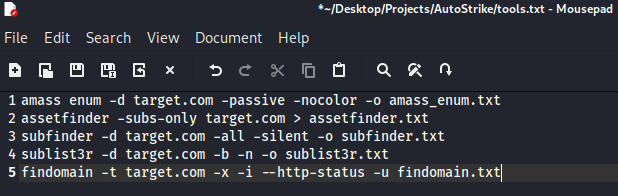
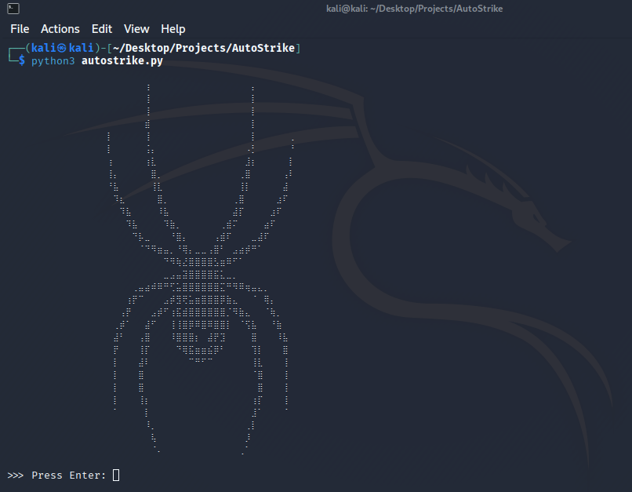

# AutoStrike
You can automate the pentest stages.

### Usage

Open the tools.txt file and write the process you want to apply line by line.

Each row represents a different stage.



Then run the autostrike.py file

```bash
python3 autostrike.py
```



The entire process is instantly written to the output.txt file.

I designed it so that you can work even while you sleep.

Do not run more than 10 processes at the same time.
